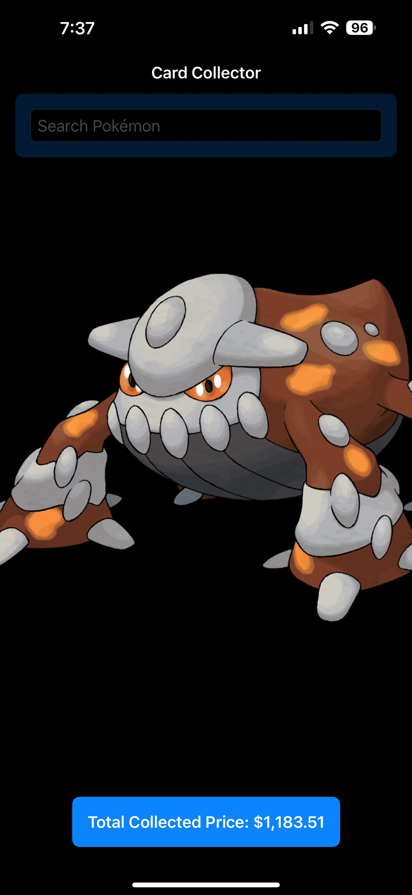
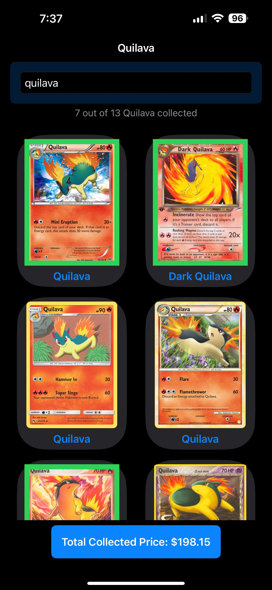
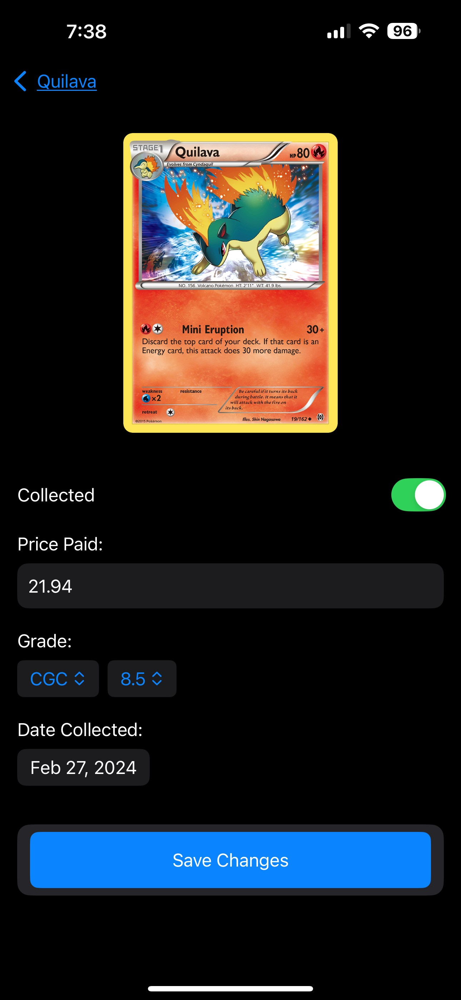

This is an IOS app written in swift. use xcode to compile, must have a apple dev account or a way of signing the app.

change variables in config to your api key and worker url

Home screen cycles threw all images in the imageURLList, you can change it to a new url if you got other pictures you want to use.

