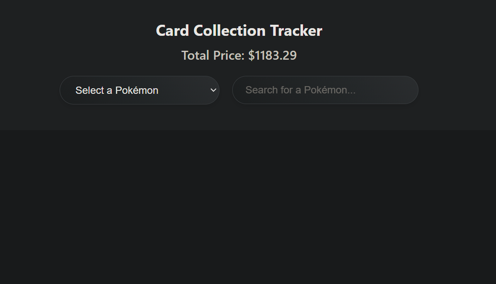
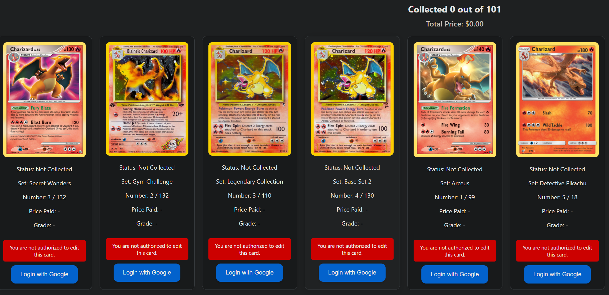
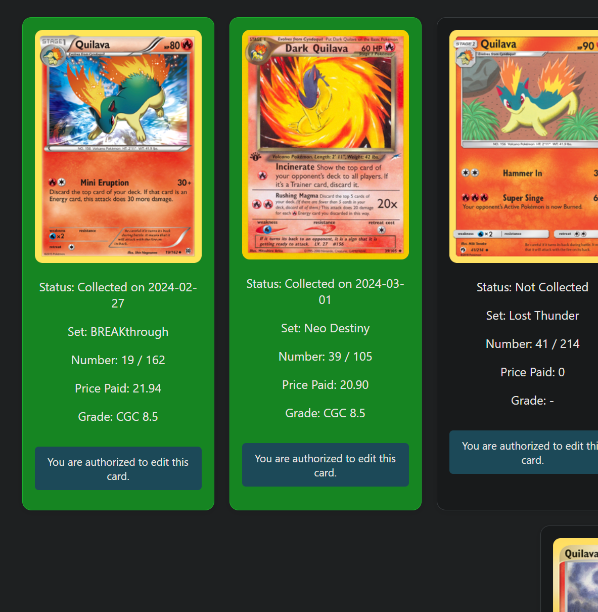
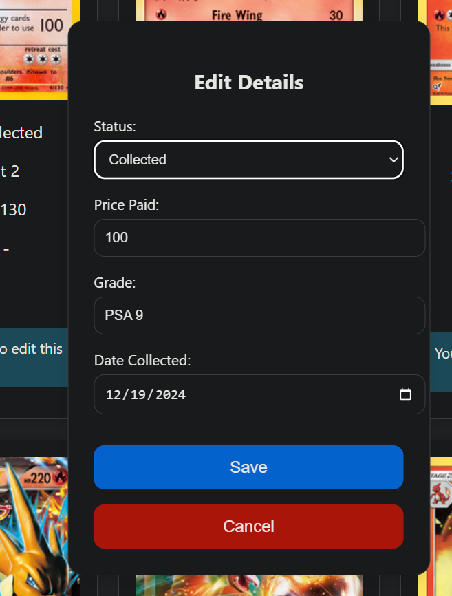

tallies up the sum of your whole collection, good for getting upset on how much you have paid.
has very badly integrated google authentication to try to stop the average joe from messing with your collection.

You can mark cards as collected or not collected, how much you paid, and your grade of card you got.

Note: I suck at this shit, so its not very good.

pull requests are highly welcomed to make this shit better.

